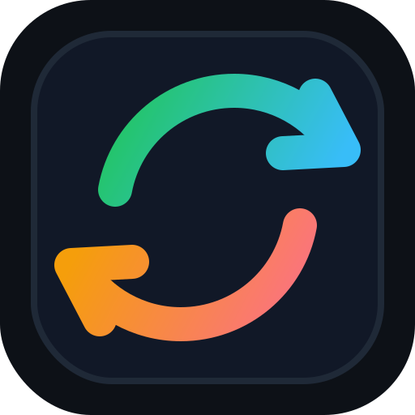

<p align="center">
  <a href="https://github.com/oleg-koval/mac-onboarding/actions/workflows/test.yml"></a>
  <a href="https://goreportcard.com/report/github.com/oleg-koval/mac-onboarding"></a>
  <a href="https://scorecard.dev/viewer/?uri=github.com/oleg-koval/mac-onboarding"></a>
</p>

<p align="center">
  
</p>

<h1 align="center">mac-onboarding</h1>

<p align="center">
  Privacy-first macOS configuration bootstrapper<br>
  <strong>Export a source Mac, restore a fresh Mac, and keep setup repeatable</strong>
</p>

---

## Features

- **Mac Configuration Export** - Capture apps, dotfiles, shell config, system settings, hotkeys, and app preferences
- **Safe Restore Flow** - Replay a portable archive on a new Mac with dry-run support
- **Homebrew Bundle Support** - Export `~/.Brewfile` and restore packages with `brew bundle install`
- **Bridge Mode** - Pull configuration live from a source Mac over Tailscale SSH without an intermediate archive
- **MDM-Aware Defaults** - Avoid protected enrollment settings and only apply allowed macOS defaults
- **Secret Redaction** - Filter shell rc files, git credentials, API keys, tokens, and AI tool config
- **Selective Modules** - Run the whole setup or narrow to modules such as `brew`, `shell`, `git`, or `kitty`
- **Homebrew Distribution** - Install with `brew install mac-onboarding`
- **Auto-Updates** - Homebrew installs check for updates on launch and upgrade before running
- **Go CLI** - Small Cobra-based binary with focused commands and no cloud dependency

## Installation

### Using Homebrew (Recommended)

```bash
brew tap oleg-koval/tap
brew install mac-onboarding
mac-onboarding --version
```

### From Source

```bash
git clone https://github.com/oleg-koval/mac-onboarding.git
cd mac-onboarding
make build
./dist/mac-onboarding --version
```

### Direct Download

Download macOS binaries from [GitHub Releases](https://github.com/oleg-koval/mac-onboarding/releases/tag/v0.2.8).

```bash
# Apple Silicon
curl -Lo mac-onboarding https://github.com/oleg-koval/mac-onboarding/releases/download/v0.2.8/mac-onboarding-darwin-arm64

# Intel
curl -Lo mac-onboarding https://github.com/oleg-koval/mac-onboarding/releases/download/v0.2.8/mac-onboarding-darwin-amd64

chmod +x mac-onboarding
sudo mv mac-onboarding /usr/local/bin/
```

Set `MAC_ONBOARDING_AUTOUPDATE=0` to disable startup auto-update checks for Homebrew-managed installs.

## Quick Start

### Export From Source Mac

```bash
# Inspect what will be captured
mac-onboarding export --dry-run ~/onboard.tar.gz

# Create the archive
mac-onboarding export ~/onboard.tar.gz
```

### Install On Target Mac

```bash
# Inspect what will be restored
mac-onboarding install --dry-run ~/onboard.tar.gz

# Apply the setup
mac-onboarding install ~/onboard.tar.gz
```

### Bridge Mode

```bash
# Pull everything from the configured source Mac
mac-onboarding bridge pull

# Pull only selected modules
mac-onboarding bridge pull --only brew,shell,git
```

Bridge mode requires `source.host` in `onboard.yaml`, Tailscale SSH access, and the same username on both Macs.

## Configuration

Copy the example config and edit it for your machines:

```bash
cp onboard.yaml.example onboard.yaml
```

```yaml
source:
  host: source-mac.tailnet-name.ts.net

modules:
  bootstrap:
    skip: false

  brew:
    skip: false
    options:
      brewfile_path: ~/.Brewfile

  shell:
    skip: false
    options:
      redact_pattern: "export .*(KEY|TOKEN|SECRET|PASSWORD|API)=.*"

  git:
    skip: false

  system:
    skip: false
```

All paths support `~` and `$HOME`. Set `skip: true` on any module you do not want to export or restore.

### Environment Variables

- `MAC_ONBOARDING_AUTOUPDATE` - Set to `0` to disable Homebrew startup auto-updates

Example:

```bash
MAC_ONBOARDING_AUTOUPDATE=0 mac-onboarding export ~/onboard.tar.gz
```

## Commands Reference

### Global Flags

- `--config <path>` - Config file, defaults to `./onboard.yaml` or `~/.config/mac-onboarding/onboard.yaml`
- `--dry-run` - Print what would happen without making changes
- `--only <modules>` - Run only selected modules
- `-v, --verbose` - Print verbose output
- `-h, --help` - Show help
- `--version` - Show version

### Export Subcommand

```bash
mac-onboarding export [ARCHIVE_PATH]
mac-onboarding export --output ~/onboard.tar.gz
mac-onboarding export --to-stdout
```

### Install Subcommand

```bash
mac-onboarding install [ARCHIVE_PATH]
mac-onboarding install --input ~/onboard.tar.gz
mac-onboarding install --from-stdin
```

### Bridge Subcommand

```bash
mac-onboarding bridge pull
mac-onboarding bridge pull --only brew,shell
mac-onboarding bridge pull --dry-run
```

## Supported Modules

| Module | Exports | Install behavior |
| --- | --- | --- |
| `bootstrap` | None | Installs Xcode CLT, Homebrew, detects MDM |
| `brew` | `~/.Brewfile` | Runs `brew bundle install` |
| `shell` | zsh/bash rc files, oh-my-zsh custom | Redacts secrets and restores rc files |
| `git` | `.gitconfig`, `.gitignore_global`, `.config/git/` | Redacts credential helpers |
| `system` | Dock, Finder, keyboard, trackpad, screenshots | Applies MDM-safe defaults |
| `hotkeys` | `com.apple.symbolichotkeys.plist` | Restores hotkeys and restarts `pbs` |
| `kitty` | `~/.config/kitty/` | Restores terminal config |
| `cursor` | Settings, keybindings, snippets, extensions | Restores config and installs extensions |
| `ai_tools` | Claude, Codex, pi.dev config | Restores config while excluding ephemeral files |
| `prefs` | SwiftBar, Alfred, Klack, flux, BetterDisplay, OrbStack, Tailscale, Shottr, Synology, 1Password | Restores supported app preferences or prints setup guidance |

## System Requirements

- macOS 11+ Big Sur or later
- Git
- Homebrew, installed automatically by the bootstrap module when needed
- Tailscale, only required for bridge mode
- Go 1.25+ for source builds

## Documentation

- [Website](https://mac.olegkoval.com/) - Project landing page
- [Example config](onboard.yaml.example) - Complete module configuration template
- [GitHub Releases](https://github.com/oleg-koval/mac-onboarding/releases) - Published binaries
- [Issues](https://github.com/oleg-koval/mac-onboarding/issues) - Bug reports and feature requests

## Use Cases

### Fresh Mac Setup

Export on the old Mac, move the archive, then restore on the new Mac:

```bash
mac-onboarding export ~/onboard.tar.gz
mac-onboarding install ~/onboard.tar.gz
```

### Repeatable Workstation Baseline

Keep `onboard.yaml` in a private repo and run only the modules you trust for team machines:

```bash
mac-onboarding export --only brew,shell,git ~/baseline.tar.gz
mac-onboarding install --only brew,shell,git ~/baseline.tar.gz
```

### Live Migration Over Tailscale

Pull selected modules directly from the source Mac:

```bash
mac-onboarding bridge pull --only brew,shell,kitty
```

## Architecture

mac-onboarding is built with:

- **Go 1.25+** - Single compiled CLI binary
- **Cobra** - Command and flag handling
- **YAML** - Human-readable setup configuration
- **tar.gz archives** - Portable export format
- **Homebrew** - Package restore and binary distribution
- **Tailscale SSH** - Optional live bridge transport

The tool is intentionally local-first: no hosted backend, no cloud sync, and no remote state.

## Project Status

- **Alpha Release** - Current release line `v0.2.x`
- Tests passing across core archive, config, shell, and updater packages
- GitHub Actions build and release automation active
- Homebrew tap distribution active
- macOS-focused by design

## Security Notes

- Archives should be reviewed before transfer: `tar tzf onboard.tar.gz`
- Alfred workflows and app preference folders may contain credentials
- SSH private keys, password manager data, and cloud sessions are not captured
- MDM-protected settings are skipped or constrained by allowlist behavior

## Contributing

Issues and PRs welcome. Keep changes small, tested, and aligned with the existing module structure.

## License

MIT

## Author

[@oleg-koval](https://github.com/oleg-koval)

---

<p align="center">
  <strong>mac-onboarding keeps Mac setup repeatable without cloud sync or Time Machine</strong><br>
  <a href="https://github.com/oleg-koval/mac-onboarding/issues">Report Issues</a> •
  <a href="https://github.com/oleg-koval/mac-onboarding/releases">Releases</a> •
  <a href="https://mac.olegkoval.com/">Website</a>
</p>
